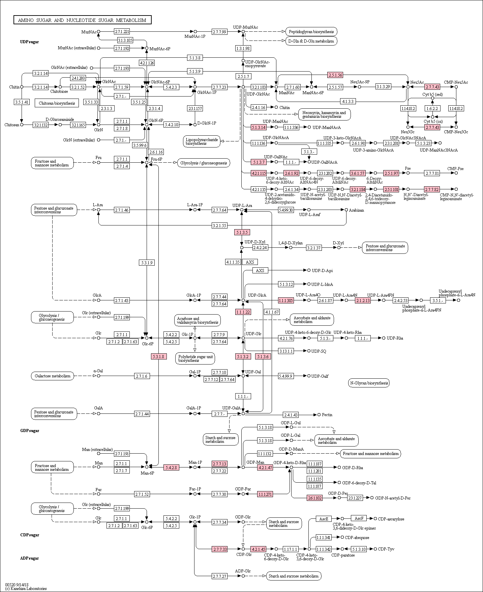

# Supporting data and code for "Phosphonate production in marine microbes: exploring new sources and potential function"

[Preprint available from bioRxiv](https://www.biorxiv.org/content/10.1101/2020.11.04.368217v1)

Data and code here is provided “AS IS” WITHOUT WARRANTY OF ANY KIND, EITHER EXPRESSED OR IMPLIED under the GNU General Public License v3.0. Feel free to use or remix as you see fit.

The `data` directory contains results and summary tables needed to support the conclusions of the paper. It is basically formatted output from the `code` directory and should be clearly organized and user friendly. The `code` directory has many different bash and R scripts in varying degrees of "user-friendliness" and is presented here mainly in the interest of transparency and not as a software tool for production use. The directories are organized by the type of analysis performed in the paper and *should be* modifiable to suite your computing environment and needs if you have the time and programming experience.

## Note on reproducibility
The [GEOTRACES](https://www.bodc.ac.uk/geotraces/data/idp2017/) data license is not GPL3 and you must request access and be approved before being allowed to download the data. Therefore, I can not include the GEOTRACES data here since it would be in violation of the license agreement. Unfortunately, this means that the workflows in the code directory are not truly reproducible since they do not include the GEOTRACES data. You can fill in the missing data for yourself by following the code available here - https://doi.org/10.5281/zenodo.3689249. You will then simply need to replace the completed data files with the onces provided in this repository here which contain NA values for all GEOTRACES chemical measurements. However, all measurements for Prochlorococcus and SAR11 ecotype abundance are included.

## Shortcuts

### Phosphonate biosynthesis
- [Summary of PepM genes](data/phosphonate_biosynthesis/GORG_tropics/pepm_genes.md) identified in [GORG-tropics](https://doi.org/10.1016/j.cell.2019.11.017)
- [Summary of PepM genes](data/phosphonate_biosynthesis/MARMICRODB/pepm_genes.md) identified in [MARMICRODB](https://zenodo.org/record/3520509)
- [Summary of MpnS genes](data/phosphonate_biosynthesis/GORG_tropics/mpns_genes.md) identified in [GORG-tropics](https://doi.org/10.1016/j.cell.2019.11.017)
- [Summary of MpnS genes](data/phosphonate_biosynthesis/MARMICRODB/mpns_genes.md) identified in [MARMICRODB](https://zenodo.org/record/3520509)
- [HMM models](data/phosphonate_biosynthesis/HMM_models) for identifying phosphonate biosynthesis genes

### Phosphonate catabolism
- [Gene families](data/phosphonate_catabolism/HMM_models/phosphonate_utilization_families.md) used to identify 4 discrete phosphonate catabolism pathways in genomes
- [HMM models](data/phosphonate_catabolism/HMM_models) for identifying phosphonate catabolism genes

### Core genes families
- [Summary of core genes](data/core_gene_families/core_gene_families.tsv) used for metagenome normalization
- [HMM models](data/core_gene_families/HMM_models) used for identifying genes used in metagenome normalization
- [HMM alignments](data/core_gene_families/HMM_alignments) used to produce core gene HMMs

### Genome context around PepM clusters in Prochlorococcus SB, SAR11 RS40, and SAR11 HTCC7217

[Prochlorococcus SB Phosphonoglycoprotein locus and potential S-layer proteins](data/pepm_genome_context/eggnogmapper/phosphonoglycoprotein_biosyn_locus.tsv)

#### Annotations from [antiSMASH](https://antismash.secondarymetabolites.org/)

Blin, K., S. Shaw, K. Steinke, R. Villebro, N. Ziemert, S. Y. Lee, M. H. Medema, and T. Weber. 2019. antiSMASH 5.0: updates to the secondary metabolite genome mining pipeline. Nucleic Acids Res. 47: W81–W87.

- [Prochlorococcus SB antiSMASH results.](http://htmlpreview.github.io/?https://github.com/slhogle/phosphonates/blob/master/data/pepm_genome_context/antismash/prochlorococcus_SB/index.html) PepM cluster is in region 2.10. 
- [SAR11 RS40 antiSMASH results.](http://htmlpreview.github.io/?https://github.com/slhogle/phosphonates/blob/master/data/pepm_genome_context/antismash/SAR11_RS40/index.html) PepM cluster is in region 1.5
- [SAR11 HTCC7217 antiSMASH results.](http://htmlpreview.github.io/?https://github.com/slhogle/phosphonates/blob/master/data/pepm_genome_context/antismash/SAR11_HTCC7217/index.html) PepM cluster is in region 1.3

### Functional enrichments near PepM clusters
Enrichments estimated from hypergeometric test implemented in clusterProfiler

Yu, G., L.-G. Wang, Y. Han, and Q.-Y. He. 2012. clusterProfiler: an R package for comparing biological themes among gene clusters. OMICS 16: 284–287.

- [clusterProfiler results](data/pepm_genome_context/clusterprofiler/enrichment_scores.tsv)
- Kegg enzymes in red are found to be enriched using [clusterProfiler](https://bioconductor.org/packages/release/bioc/html/clusterProfiler.html)



### Directory Structure
```
.
├── code
│   ├── gene-prevalence-genomes
│   │   ├── MARMICRODB
│   │   │   ├── bin
│   │   │   └── input-data
│   │   └── gorg-tropics
│   │       ├── bin
│   │       ├── figs
│   │       └── input-data
│   ├── gene-searches
│   │   ├── MARMICRODB
│   │   │   ├── bin
│   │   │   ├── figs
│   │   │   ├── input-data
│   │   │   │   ├── phn-synthesis
│   │   │   │   └── phn-utilization
│   │   │   └── results-tables
│   │   └── gorg-tropics
│   │       ├── bin
│   │       ├── input-data
│   │       │   ├── phn-synthesis
│   │       │   └── phn-utilization
│   │       └── results-tables
│   ├── metagenome-abundances-model
│   │   ├── bin
│   │   ├── figs
│   │   ├── input
│   │   └── output
│   ├── metagenome-data-wrangling
│   │   ├── bin
│   │   ├── input
│   │   ├── output
│   │   └── output-old
│   ├── metagenome-searches
│   │   ├── mock-metagenome
│   │   │   ├── check_tax_GORG_pepm_scaffolds
│   │   │   │   └── data
│   │   │   ├── diamond-search-mockreads
│   │   │   │   ├── data
│   │   │   │   ├── figs
│   │   │   │   └── tables
│   │   │   └── pepm_mgassembly_searches
│   │   │       └── data
│   │   │           ├── GEOTRACES
│   │   │           └── TARA-OM-RGC
│   │   ├── pepm-counts
│   │   └── pro-syn-sar-core-counts
│   ├── pepm-enrichment-analysis
│   │   ├── bin
│   │   ├── input-data
│   │   │   ├── coords
│   │   │   ├── eggnoggmapped
│   │   │   ├── go
│   │   │   └── kegg
│   │   └── results-tables
│   ├── pepm-position-islands
│   │   ├── bin
│   │   ├── figs
│   │   └── input-data
│   └── phylogenies
│       ├── gtdbtk-v-pepm-tree-comparisons
│       │   ├── data
│       │   └── results
│       └── phn-utilization-synthesis
│           ├── bin
│           ├── data
│           └── figs
└── data
    ├── core_gene_families
    │   ├── HMM_alignments
    │   └── HMM_models
    ├── pepm_genome_context
    │   ├── antismash
    │   │   ├── SAR11_HTCC7217
    │   │   ├── SAR11_RS40
    │   │   └── prochlorococcus_SB
    │   ├── clusterprofiler
    │   └── eggnogmapper
    ├── phosphonate_biosynthesis
    │   ├── GORG_tropics
    │   ├── HMM_models
    │   │   ├── MPNS
    │   │   │   ├── alns
    │   │   │   ├── hmm
    │   │   │   └── seqs
    │   │   ├── PEPM
    │   │   ├── PPDA
    │   │   └── PPDH
    │   └── MARMICRODB
    └── phosphonate_catabolism
        ├── GORG_tropics
        ├── HMM_models
        │   ├── gntR
        │   ├── hpnW
        │   ├── hpnX
        │   ├── hpnZ
        │   ├── lysR
        │   ├── phn01
        │   ├── phn02
        │   ├── phnA
        │   ├── phnC
        │   ├── phnD
        │   ├── phnD-like
        │   ├── phnE
        │   ├── phnF
        │   ├── phnG
        │   ├── phnH
        │   ├── phnI
        │   ├── phnJ
        │   ├── phnK
        │   ├── phnL
        │   ├── phnM
        │   ├── phnN
        │   ├── phnO
        │   ├── phnP
        │   ├── phnS
        │   ├── phnS2
        │   ├── phnT
        │   ├── phnT2
        │   ├── phnU
        │   ├── phnU2
        │   ├── phnV
        │   ├── phnW
        │   ├── phnX
        │   ├── phnY
        │   ├── phnZ
        │   ├── phyH
        │   └── ptxD
        └── MARMICRODB
```