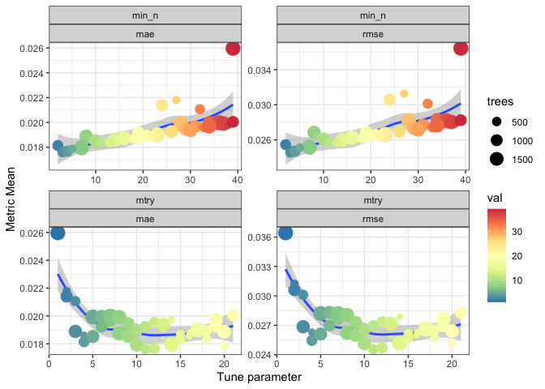
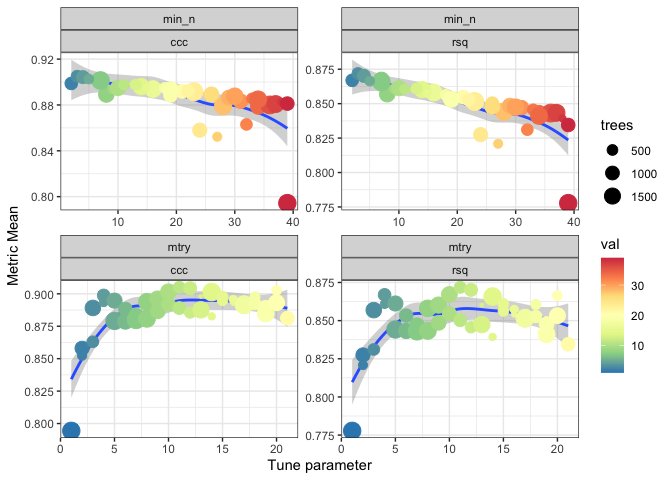
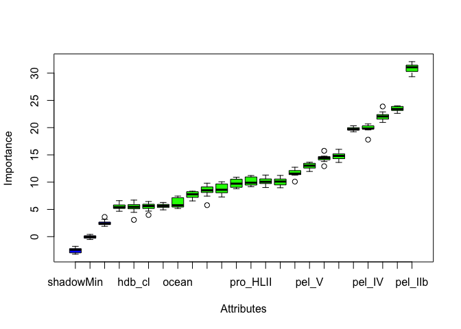

Modelling prochlorococcus/SAR11 pepm abundance using environmental
covariates
================

  - [INTRO](#intro)
  - [READ DATA](#read-data)
  - [VARIABLE SUBSETTING](#variable-subsetting)
  - [VARIABLE REDUCTION](#variable-reduction)
  - [SAVE DATASET FOR EASY RELOADING](#save-dataset-for-easy-reloading)
  - [DATA SPLITTING & RESAMPLING](#data-splitting-resampling)
  - [DEFINE RECIPE](#define-recipe)
  - [SPECIFY MODEL](#specify-model)
  - [WORKFLOW](#workflow)
  - [TUNING](#tuning)
      - [AUTOTUNE](#autotune)
      - [MANUALTUNE](#manualtune)
  - [MODEL SELECTION](#model-selection)
  - [FINAL WORKFLOW](#final-workflow)
  - [EVALUATE FINAL WORKFLOW ON FULL TEST
    SET](#evaluate-final-workflow-on-full-test-set)
  - [FINAL PERFORMANCE METRICS](#final-performance-metrics)
  - [FINAL FIT USING FINAL MODEL](#final-fit-using-final-model)
  - [VARIABLE IMPORTANCE - FIRST
    LOOK](#variable-importance---first-look)
  - [BORUTA W SELECTED
    HYPERPARAMETERS](#boruta-w-selected-hyperparameters)

# INTRO

useful tutorials:
<http://www.rebeccabarter.com/blog/2020-03-25_machine_learning>
<https://juliasilge.com/blog/sf-trees-random-tuning/>
<https://www.tidymodels.org/start/case-study/>
<https://bradleyboehmke.github.io/HOML/random-forest.html>

feature selection:
<http://blog.datadive.net/selecting-good-features-part-iii-random-forests/>
<https://academic.oup.com/bib/article/20/2/492/4554516>

SO questions on colinearity:
<https://stats.stackexchange.com/questions/168622/why-is-multicollinearity-not-checked-in-modern-statistics-machine-learning>
<https://stats.stackexchange.com/questions/141619/wont-highly-correlated-variables-in-random-forest-distort-accuracy-and-feature>

Evaluating performance
<https://bookdown.org/max/FES/measuring-performance.html>

``` r
library(here)
library(tidyverse)
library(tidymodels)

library(parallel)
library(foreach)
library(doParallel)

library(ranger)
library(Boruta)

library(ggforce)
```

So the GEOTRACES data license is not GPL3 and you must request access
and be approved before being allowed to download. So I am not including
the GEOTRACES data here since it would be in violation of their license
agreement. Unfortunately, this means that this is not truly reproducible
as is. You can fill in the missing data for yourself by following the
code available here - <https://doi.org/10.5281/zenodo.3689249>.

# READ DATA

Preformatted dataset from wrangler.rmd

``` r
pepm <- readRDS(here::here("input", "pepm.global.final")) %>%
  group_by(sampleID, group) %>% 
  slice(1) %>%
  ungroup() %>%
  filter(sampleID != "S0468")
```

# VARIABLE SUBSETTING

``` r
a <- full_join(filter(pepm, group=="sar11") %>% select(sampleID, sar11_pepm=RA),
               filter(pepm, group=="prochlorococcus") %>% select(sampleID, pro_pepm=RA)) %>%
  mutate(pro_pepm=ifelse(is.na(pro_pepm), 1e-7, pro_pepm)) %>%
  mutate(pro_pepm=ifelse(pro_pepm > 1, 0.99, pro_pepm)) %>%
  mutate(sar11_pepm=ifelse(is.na(sar11_pepm), 1e-7, sar11_pepm)) %>%
  mutate(sar11_pepm=ifelse(sar11_pepm > 1, 0.99, sar11_pepm))
```

    ## Joining, by = "sampleID"

``` r
PEPMreads2forest <- pepm %>%
  select_if(!str_detect(names(.), "imputed_")) %>%
  select_if(!str_detect(names(.), "pro_LLVII")) %>% 
  select_if(!str_detect(names(.), "Long")) %>%
  filter(group=="bactarc") %>%
  select(-pro, -sar11, -section, -lat, -lon, -group, -W, -M,
         -synDarwin_umolC.kg, -proDarwin_umolC.kg,
         -DOFe_darwin_clim, -POFe_darwin_clim) %>% 
  #drop_na() %>%
  mutate(RA=ifelse(RA > 1, 0.99, RA)) %>%
  mutate(RA=ifelse(is.na(RA), 1e-4, RA)) %>%
  left_join(., a) %>%
  select(-sampleID,
         -bacteria,                       # redundant with archaea
         -pro_LLII_LLIII,                 # redundant with pro_LLIV
         -pel_IIIb,                       # freshwater clade
         -pel_Ic,                         # redundant with pel_IIb
         #-archaea,                        # redundant with pel_IIb
         -DOironDarwin_dissolved_nmol.kg, # redundant with DOPDarwin_dissolved_umol.kg
         -copper_dissolved_nmol.kg,       # nitrateDarwin_dissolved_umol.kg
         -ironDarwin_dissolved_nmol.kg)   # nitrateDarwin_dissolved_umol.kg
```

    ## Joining, by = "sampleID"

# VARIABLE REDUCTION

These RFs quickly get big and very time consuming. Here we look at
variance between RA and variables. Consolidate variables that correlate
significantly with each other ( \> 0.8) so that we remove redundancy.

``` r
cordf <- PEPMreads2forest %>%
  select_if(~ is.numeric(.))

df_corr <- round(cor(cordf, method="spearman"), 2) %>%
  as.data.frame() %>%
  rownames_to_column(var="source") %>%
  pivot_longer(cols=-source, names_to="target", values_to="corr") %>%
  filter(source != target) 

hicor <- round(cor(cordf, method="spearman"), 2) %>%
  as.data.frame() %>%
  rownames_to_column() %>%
  filter(abs(RA) >= 0.3) %>%
  pull(rowname)

hicor <- append(hicor, c("dcm.layer", "hdb_cl", "ocean"))

PEPMreads2forest <- PEPMreads2forest %>%
  select_if(names(.) %in% hicor)
```

# SAVE DATASET FOR EASY RELOADING

``` r
saveRDS(PEPMreads2forest, here::here("input", "PEPMreads2forest.bactarc"))
```

# DATA SPLITTING & RESAMPLING

For a data splitting strategy, we reserve 20% of data to the test set.
The rest will be used for training th emodel

``` r
pepm.split <- initial_split(PEPMreads2forest, prop = 0.8)
```

training/validation/total

``` r
pepm.split
```

    ## <Analysis/Assess/Total>
    ## <516/128/644>

Extract training and testing sets

``` r
pepm.split.train <- training(pepm.split)
pepm.split.test <- testing(pepm.split)
```

Create cross-fold object for the training set

``` r
pepm.split.train.crossval <- vfold_cv(pepm.split.train)
```

# DEFINE RECIPE

Create recipe and roles for testing set

``` r
pepm.recipe <- recipe(RA ~ ., data = PEPMreads2forest) %>% 
  #step_rm(section, RPK_prochlorococcus_TBDT, RPK_total_prochlorococcus_reads, RPK_prochlorococcus_marker_median, W, M, lat, lon, LongCode, LongDesc, synDarwin_umolC.kg, proDarwin_umolC.kg, DOPDarwin_dissolved_umol.kg, oxygen_dissolved_umol.kg, pro_LLVII, imputed_iron, imputed_lead, imputed_manganese, imputed_zinc, imputed_cobalt, imputed_nickel, imputed_aluminum, imputed_copper) %>% 
  #update_role(sampleID, new_role = "ID") %>% 
  #step_dummy(all_nominal(), -all_outcomes(), -sampleID) %>% 
  #step_zv(all_predictors()) %>%
  step_normalize(all_predictors(), -dcm.layer, -hdb_cl, -ocean) #%>%
  #step_corr(all_predictors(), threshold = .6) #potentially remove highly correlated variables
```

apply the recipe to the training data and extract/inspect the
pre-processed training dataset

``` r
pepm.split.train.preprocessed <- pepm.recipe %>%
  prep(pepm.split.train) %>%
  juice()

head(pepm.split.train.preprocessed)
```

    ## # A tibble: 6 x 16
    ##    depth dcm.layer hdb_cl nitrateDarwin_d… phosphateDarwin… ocean pro_HLII
    ##    <dbl> <fct>     <fct>             <dbl>            <dbl> <fct>    <dbl>
    ## 1 -0.951 1         1              -0.00272            0.809 atla…  -0.875 
    ## 2 -0.262 0         1               0.325              1.07  atla…  -0.605 
    ## 3  0.168 0         1               0.741              1.38  atla…  -0.365 
    ## 4  0.616 0         1               0.924              1.60  atla…   0.0713
    ## 5  2.30  0         1               1.30               2.72  atla…  -0.165 
    ## 6 -0.951 1         1               0.259              0.253 atla…  -0.502 
    ## # … with 9 more variables: pro_LLI <dbl>, pro_LLIV <dbl>, pel_IIb <dbl>,
    ## #   pel_IV <dbl>, pel_V <dbl>, archaea <dbl>, viruses <dbl>, sar11_pepm <dbl>,
    ## #   RA <dbl>

# SPECIFY MODEL

  - using random forest from `ranger`
  - tune mtry and num.trees parameters
  - select engine
      - ranger
      - importance = impurity
      - splitrule = beta
  - regression mode

<!-- end list -->

``` r
pepm.rand.forest.model <- rand_forest() %>%
  set_args(mtry = tune(), min_n = tune(), trees=3000) %>%
  set_engine("ranger", 
             importance = "permutation", 
             splitrule = "beta",
             replace = FALSE) %>%
  set_mode("regression")
```

# WORKFLOW

``` r
pepm.rand.forest.workflow <- workflow() %>%
  add_recipe(pepm.recipe) %>%
  add_model(pepm.rand.forest.model)
```

# TUNING

Tune parameter grid using metrics root mean squared error, mean absolute
error, and the concordance correlation coefficient. We can either
manually specify tuning parameters or allow tidymodel to do it
automatically

## AUTOTUNE

Run parameter tuning using an automated grid selection first. (Run on
cluster)

``` r
pepm.rand.forest.autotune <- pepm.rand.forest.workflow %>%
  tune_grid(resamples = pepm.split.train.crossval,
            grid = 20,
            metrics = metric_set(rmse, mae, ccc, rsq),
            control = control_grid(verbose = TRUE,
                                  allow_par = TRUE,
                                  extract = NULL,
                                  save_pred = FALSE,
                                  pkgs = NULL))
```

examine cross validation results for the automatically specified grid

``` r
pepm.rand.forest.autotune <- readRDS(here::here("input", "rand.forest.autotune.par.bactarc"))

collect_metrics(pepm.rand.forest.autotune) %>%
  pivot_longer(cols=c("mtry", "min_n"), names_to="var", values_to="val") %>%
  filter(.metric %in% c("mae", "rmse")) %>%
  ggplot(aes(x=val, mean, color = val)) +
  geom_smooth(method="loess", se=T) +
  geom_point(aes(size=trees)) +
  facet_wrap(var~.metric, scales = "free") +
  scale_color_distiller(palette="Spectral") + 
  labs(x = "Tune parameter", y = "Metric Mean") +
  theme_bw()
```

    ## `geom_smooth()` using formula 'y ~ x'

<!-- -->

``` r
collect_metrics(pepm.rand.forest.autotune) %>%
  pivot_longer(cols=c("mtry", "min_n"), names_to="var", values_to="val") %>%
  filter(!(.metric %in% c("mae", "rmse"))) %>%
  ggplot(aes(x=val, mean, color = val)) +
  geom_smooth(method="loess", se=T) +
  geom_point(aes(size=trees)) +
  facet_wrap(var~.metric, scales = "free") +
  scale_color_distiller(palette="Spectral") + 
  labs(x = "Tune parameter", y = "Metric Mean") +
  theme_bw()
```

    ## `geom_smooth()` using formula 'y ~ x'

<!-- -->

``` r
select_best(pepm.rand.forest.autotune, "rsq")
```

    ## # A tibble: 1 x 3
    ##    mtry trees min_n
    ##   <int> <int> <int>
    ## 1    11   671     3

## MANUALTUNE

Make a manual grid based on results from the automatic grid

``` r
pepm.rand.forest.grid <- grid_regular(
  mtry(range = c(10, 30)),
  min_n(range = c(1, 3)),
  levels = 7)

pepm.rand.forest.grid
```

    ## # A tibble: 21 x 2
    ##     mtry min_n
    ##    <int> <int>
    ##  1    10     1
    ##  2    13     1
    ##  3    16     1
    ##  4    20     1
    ##  5    23     1
    ##  6    26     1
    ##  7    30     1
    ##  8    10     2
    ##  9    13     2
    ## 10    16     2
    ## # … with 11 more rows

Run the grid

``` r
pepm.rand.forest.mantune <- pepm.rand.forest.workflow %>%
  tune_grid(resamples = pepm.split.train.crossval,
            grid = pepm.rand.forest.grid,
            metrics = metric_set(rmse, mae, ccc, rsq))
```

examine cross validation results for the manually specified grid

``` r
pepm.rand.forest.mantune <- readRDS(here::here("input", "pepm.rand.forest.mantune.par"))

collect_metrics(pepm.rand.forest.mantune) %>%
  mutate(min_n=as.factor(min_n)) %>%
  #pivot_longer(cols=c("mtry", "min_n"), names_to="var", values_to="val") %>%
  ggplot(aes(x=mtry, mean, color = min_n, group = min_n)) +
  #geom_smooth(method="loess", se=T) +
  geom_point(size=2) +
  geom_line() + 
  facet_wrap(~.metric, scales = "free", nrow=2) +
  scale_color_brewer(palette="Dark2") + 
  labs(x = "Tune parameter", y = "Metric Mean") +
  theme_bw()
```

# MODEL SELECTION

``` r
select_best(pepm.rand.forest.mantune, "rsq")
```

``` r
pepm.rand.forest.mantune.best <- tibble(mtry=6, min_n=1)
```

``` r
pepm.rand.forest.model.final <- finalize_model(pepm.rand.forest.model,
                                               pepm.rand.forest.mantune.best)

pepm.rand.forest.model.final
```

# FINAL WORKFLOW

update workflow to the best model based on ccc

``` r
pepm.rand.forest.workflow.final <- workflow() %>%
  add_recipe(pepm.recipe) %>%
  add_model(pepm.rand.forest.model.final)
```

# EVALUATE FINAL WORKFLOW ON FULL TEST SET

Now we’ve defined our recipe, our model, and tuned the model’s
parameters, we’re ready to actually fit the final model. Since all of
this information is contained within the workflow object, we will apply
the last\_fit() function to our workflow and our train/test split
object. This will automatically train the model specified by the
workflow using the training data, and produce evaluations based on the
test set.

``` r
pepm.rand.forest.results.final <- pepm.rand.forest.workflow.final %>%
  last_fit(pepm.split)
```

``` r
saveRDS(pepm.rand.forest.results.final, here::here("input", "pepm.rand.forest.results.final"))
```

# FINAL PERFORMANCE METRICS

``` r
pepm.rand.forest.results.final <- readRDS(here::here("input", "pepm.rand.forest.results.final"))

pepm.rand.forest.results.final %>%
  collect_metrics(metric_set(rmse, mae, ccc))
```

    ## # A tibble: 2 x 3
    ##   .metric .estimator .estimate
    ##   <chr>   <chr>          <dbl>
    ## 1 rmse    standard      0.0147
    ## 2 rsq     standard      0.690

# FINAL FIT USING FINAL MODEL

``` r
pepm.rand.forest.fit.final <- fit(pepm.rand.forest.workflow.final, PEPMreads2forest)
```

``` r
saveRDS(pepm.rand.forest.fit.final, here::here("input", "PEPM.rand.forest.fit.final"))
```

``` r
pepm.rand.forest.fit.final <- readRDS(here::here("input", "PEPM.rand.forest.fit.final"))
```

# VARIABLE IMPORTANCE - FIRST LOOK

``` r
library(vip)

pepm.rand.forest.fit.final %>% 
  pull_workflow_fit() %>% 
  vip::vip()
```

``` r
ranger_obj <- pull_workflow_fit(PEPM.rand.forest.fit.final)$fit
ranger_obj$variable.importance
```

# BORUTA W SELECTED HYPERPARAMETERS

``` r
getImpBetaZ <- function(x, y, ntree=2000, num.trees=ntree, ...){
  x$shadow.Boruta.decision <- y
  ranger::ranger(data=x, 
                dependent.variable.name = "shadow.Boruta.decision",
                num.trees = num.trees, 
                mtry = 20,
                min.node.size = 2, 
                importance = "permutation", #variance,
                splitrule = "beta",
                scale.permutation.importance = TRUE,
                write.forest = FALSE,...)$variable.importance
}
```

Run on cluster

    borutaTBDT <- Boruta(RA ~ .,
                         getImp=getImpBetaZ,
                         data=select(tbdt.split.train.preprocessed, -sampleID),
                         doTrace=2)

``` r
borutaPEPM <- readRDS(here::here("input", "PEPMboruta.bactarc"))
```

``` r
plot(borutaPEPM)
```

<!-- -->
