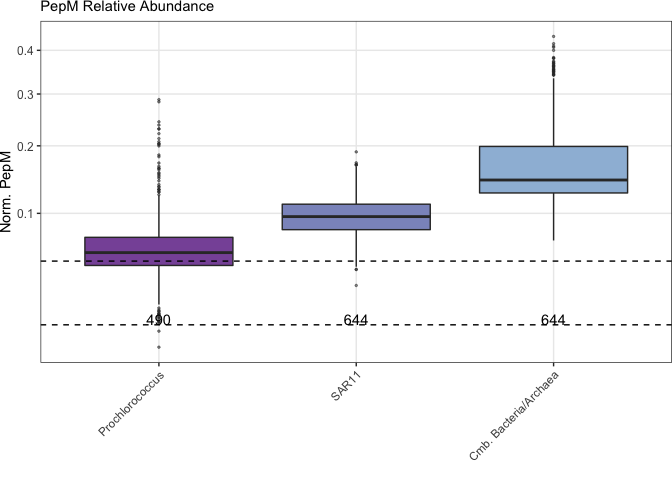

Metagenome figures
================

  - [LOAD DATA](#load-data)
      - [RELATIVE ABUNDANCE DATA](#relative-abundance-data)
      - [BORUTA RESULTS](#boruta-results)
  - [FIGURES](#figures)
      - [CORRELATION BETWEEN VARIABLES](#correlation-between-variables)
      - [PLOT CORRELATION MATRIX](#plot-correlation-matrix)
      - [PLOT RELATIVE ABUNDANCE VERSUS OCEAN
        REGION](#plot-relative-abundance-versus-ocean-region)
      - [MAIN TEXT FIGURE](#main-text-figure)
      - [NEW FIGURE 3](#new-figure-3)
      - [SCATTERPLOTS](#scatterplots)

``` r
library(here)
library(tidyverse)
library(ggforce)
library(patchwork)
library(GGally)
library(viridis)
```

# LOAD DATA

## RELATIVE ABUNDANCE DATA

Preformatted dataset

``` r
pepm <- readRDS(here::here("input", "pepm.global.final")) %>%
  group_by(sampleID, group) %>% 
  slice(1) %>%
  ungroup() %>%
  filter(sampleID != "S0468")
```

## BORUTA RESULTS

``` r
borutaPEPM.pro <- readRDS(here::here("input", "PEPMboruta.pro"))
borutaPEPM.sar11 <- readRDS(here::here("input", "PEPMboruta.sar11"))
borutaPEPM.bactarc <- readRDS(here::here("input", "PEPMboruta.bactarc"))
```

# FIGURES

## CORRELATION BETWEEN VARIABLES

Examine the degree of correlation between different continuous variables

``` r
cordf <- pepm %>%
  filter(group=="bactarc") %>%
  select_if(~ is.numeric(.)) %>%
  select_if(!str_detect(names(.), "imputed_")) %>%
  select_if(!str_detect(names(.), "pro_LLVII")) %>%
  select(-W, -M, -lat, -lon, -RA, -pel_IIIb, -DOFe_darwin_clim, 
         -POFe_darwin_clim, -proDarwin_umolC.kg, -synDarwin_umolC.kg) %>%
  rownames_to_column(var="source") %>%
  pivot_longer(cols=-source, names_to="target", values_to="val") %>%
  mutate(target=str_replace(target, "pro_", "")) %>%
  mutate(target=str_replace(target, "pel_", "SAR11 ")) %>%
  mutate(target=str_replace(target, "_dissolved_.*", "")) %>%
  mutate(target=recode(target, 
                       "chla_norm"       = "Chla",
                       "depth"           = "Depth",
                       "oxygen"          = "O2",
                       "salinity"        = "Salinity",
                       "sar11"           = "SAR11",
                       "pro"             = "Prochlorococcus",
                       "bacteria"        = "Bacteria", 
                       "archaea"         = "Archaea",
                       "eukaryotes"      = "Euks",
                       "viruses"         = "Viral",
                       "nitrite"         = "NO2",
                       "nitrate"         = "NO3",
                       "phosphate"       = "PO4",
                       "silicate"        = "SIOH4",
                       "iron"            = "Fe",
                       "copper"          = "Cu",
                       "aluminum"        = "Al",
                       "lead"            = "Pb",
                       "manganese"       = "Mn",
                       "nickel"          = "Ni",
                       "zinc"            = "Zn",
                       "cobalt"          = "Co",
                       "temperature"     = "Temp",
                       "DOironDarwin"    = "DOFe_mod",
                       "POironDarwin"    = "POFe_mod",
                       "nitrateDarwin"   = "NO3_mod",
                       "nitriteDarwin"   = "NO2_mod",
                       "phosphateDarwin" = "PO4_mod",
                       "ironDarwin"      = "Fe_mod")) %>%
  pivot_wider(names_from="target", values_from="val") %>%
  select(-source)
```

## PLOT CORRELATION MATRIX

``` r
pcor <- ggcorr(cordf, label = TRUE, label_size = 1.5, label_round = 1, label_alpha = TRUE,
       geom = "circle", nbreaks = 6, min_size = 1, max_size = 4)

pcor
```

<!-- -->

## PLOT RELATIVE ABUNDANCE VERSUS OCEAN REGION

``` r
dlongcode <- pepm %>%
  group_by(group) %>%
  count(ocean, name="oceancount")

pboxplot.ocean <- pepm %>%
  mutate(RA=ifelse(group=="prochlorococcus" & RA >0.3, NA, RA)) %>%
  mutate(group=factor(group, levels=c("prochlorococcus", "sar11", "bactarc"),
                      labels=c("Prochlorococcus", "SAR11", "Combined Bacteria/Archaea"))) %>%
  ggplot() +
  geom_sina(aes(y=RA, x=group, color=ocean), size=0.5, binwidth=1, scale="width") +
  labs(x="", y="Rel. Abund.") +  
  geom_hline(yintercept=0.05, linetype="dashed") + 
  geom_hline(yintercept=0.01, linetype="dashed") + 
  theme_bw() +
  theme(panel.grid.major=element_blank(),
        panel.grid.minor=element_blank(),
        plot.margin=unit(c(0,0,0,0),"cm"))

pboxplot.ocean
```

<!-- -->

## MAIN TEXT FIGURE

### PREPARE DATA FOR PLOTTING

#### PROCHLOROCOCCUS

``` r
fd.pro <- as.data.frame(borutaPEPM.pro$finalDecision) %>%
  rownames_to_column(var="variable") %>% 
  rename(decis=`borutaPEPM.pro$finalDecision`)

borutad.pro <- as.data.frame(borutaPEPM.pro$ImpHistory) %>%
  rownames_to_column(var="FRrun") %>%
  pivot_longer(cols=-FRrun, names_to = "variable", values_to = "value") %>%
  left_join(fd.pro) %>%
  mutate(variable=recode(variable, 
                     "nitrite_dissolved_umol.kg" = "NO2",    
                     "phosphate_dissolved_umol.kg" = "PO4",
                     "dcm.layer" = "SCML layer",
                     "hdb_cl" = "SCML type",
                     "DOPDarwin_dissolved_umol.kg" = "DOP Clim. Mean",
                     "POironDarwin_dissolved_nmol.kg" = "POIron Clim. Mean",
                     "ocean" = "Ocean",
                     "pro_HLIII_HLIV" = "HLIII/HLIV",
                     "pro_LLIV" = "LLIV",
                     "pro" = "Prochlorococcus",
                     "shadowMax" = "Random Max",
                     "shadowMean" = "Random Mean",
                     "shadowMin" = "Random Min")) %>%
  group_by(variable) %>%
  mutate(var_med=median(value)) %>%
  ungroup() %>%
  mutate(group="Prochlorococcus") %>%
  mutate(variable=fct_reorder2(variable, decis, var_med),
         decis=factor(decis))
```

    ## Joining, by = "variable"

#### SAR11

``` r
fd.sar11 <- as.data.frame(borutaPEPM.sar11$finalDecision) %>%
  rownames_to_column(var="variable") %>% 
  rename(decis=`borutaPEPM.sar11$finalDecision`)

borutad.sar11 <- as.data.frame(borutaPEPM.sar11$ImpHistory) %>%
  rownames_to_column(var="FRrun") %>%
  pivot_longer(cols=-FRrun, names_to = "variable", values_to = "value") %>%
  left_join(fd.sar11) %>%
  mutate(variable=recode(variable, 
                         "nitrate_dissolved_umol.kg" = "NO3",    
                         "dcm.layer" = "SCML layer",
                         "hdb_cl" = "SCML type",
                         "nitrateDarwin_dissolved_umol.kg" = "NO3 Clim. Mean",
                         "ocean" = "Ocean",
                         "pro" = "Prochlorococcus",
                         "pel_IIb" = "SAR11 IIb",
                         "pel_IV" = "SAR11 IV",
                         "pel_V" = "SAR11 V",
                         "viruses" = "Virus",
                         "cobalt_dissolved_pmol.kg" = "dCobalt",
                         "nickel_dissolved_nmol.kg" = "dNickel",
                         "aluminum_dissolved_nmol.kg" = "dAluminum",
                         "iron_dissolved_nmol.kg" = "dIron",
                         "bactarc_pepm" = "Total PepM",
                         "shadowMax" = "Random Max",
                         "shadowMean" = "Random Mean",
                         "shadowMin" = "Random Min")) %>%
  group_by(variable) %>%
  mutate(var_med=median(value)) %>%
  ungroup() %>%
  mutate(group="SAR11") %>%
  mutate(variable=fct_reorder2(variable, decis, var_med),
         decis=factor(decis))
```

    ## Joining, by = "variable"

#### BACTERIA/ARCHAEA

``` r
fd.bactarc <- as.data.frame(borutaPEPM.bactarc$finalDecision) %>%
  rownames_to_column(var="variable") %>% 
  rename(decis=`borutaPEPM.bactarc$finalDecision`)

borutad.bactarc <- as.data.frame(borutaPEPM.bactarc$ImpHistory) %>%
  rownames_to_column(var="FRrun") %>%
  pivot_longer(cols=-FRrun, names_to = "variable", values_to = "value") %>%
  left_join(fd.bactarc) %>%
  mutate(variable=recode(variable, 
                         "pel_IIb" = "SAR11 IIb",
                         "sar11_pepm" = "SAR11 PepM",
                         "archaea" = "Archaea",
                         "pro_LLIV" = "LLIV",
                         "pel_IV" = "SAR11 IV",
                         "depth" = "Depth",
                         "manganese_dissolved_nmol.kg" = "dManganese",
                         "pel_V" = "SAR11 V",
                         "nitrateDarwin_dissolved_umol.kg" = "NO3 Clim. Mean",
                         "viruses" = "Virus",
                         "pro_LLI" = "LLI",
                         "phosphate_dissolved_umol.kg" = "PO4",
                         "pro_HLII" = "HLII",
                         "nitrate_dissolved_umol.kg" = "NO3",
                         "nickel_dissolved_nmol.kg" = "dNickel",
                         "cobalt_dissolved_pmol.kg" = "dCobalt",
                         "hdb_cl" = "SCML type",
                         "ocean" = "Ocean",
                         "silicate_dissolved_umol.kg" = "SIOH4",
                         "dcm.layer" = "SCML layer",
                         "phosphateDarwin_dissolved_umol.kg" = "PO4 Clim. Mean",
                         "shadowMax" = "Random Max",
                         "shadowMean" = "Random Mean",
                         "shadowMin" = "Random Min")) %>%
  group_by(variable) %>%
  mutate(var_med=median(value)) %>%
  ungroup() %>%
  mutate(group="Combined Bacteria/Archaea") %>%
  mutate(variable=fct_reorder2(variable, decis, var_med),
         decis=factor(decis))
```

    ## Joining, by = "variable"

## NEW FIGURE 3

``` r
ysize <- 9
a <- pepm %>%
  mutate(RA=ifelse(group=="prochlorococcus" & RA >0.3, NA, RA)) %>%
  add_count(group) %>%
  group_by(group) %>%
  mutate(n=ifelse(row_number() != 1, NA, n)) %>%
  ungroup() %>%
  mutate(group=factor(group, 
                      levels=c("prochlorococcus", "sar11", "bactarc"))) %>%
  ggplot() +
    geom_boxplot(aes(y=RA, x=group, fill=group), alpha=1,
                 outlier.size = 0.5, outlier.alpha = 0.0) +
    geom_sina(aes(y=RA, x=group, color=depth), size=0.5, maxwidth=0.75, scale="width") +
    geom_text(aes(x=group, y=0.01, label=n), vjust=0) +
    labs(x="", y="Norm. PepM", title="") +
    scale_color_viridis_c(option = "D", begin = 0, end=0.8, direction=-1) +
    theme_bw() +
    theme(axis.text.y = element_text(size = ysize),
        panel.grid.minor=element_blank(),
        plot.margin=unit(c(0,0,0,0),"cm"))

b <- pepm %>%
  filter(group=="bactarc") %>%
  ggplot() +
    geom_smooth(aes(y=RA, x=depth)) +
    geom_point(aes(y=RA, x=depth, color=depth), size=0.5) +
    labs(x="Depth [m]", y="Norm. PepM", title="") +
    coord_flip() + 
    scale_x_reverse() + 
    scale_color_viridis_c(option = "D", begin = 0, end=0.8, direction=-1) +
    theme_bw() +
    theme(panel.grid.minor=element_blank(),
        plot.margin=unit(c(0,0,0,0),"cm"))

pmaintext <- a + b +
  plot_layout(guides="collect") + 
  plot_annotation(tag_levels = 'A')

pmaintext
```

    ## Warning: Removed 9 rows containing non-finite values (stat_boxplot).

    ## Warning: Removed 9 rows containing non-finite values (stat_sina).

    ## Warning: Removed 1775 rows containing missing values (geom_text).

    ## `geom_smooth()` using method = 'loess' and formula 'y ~ x'

<!-- -->

### MAKE PLOTS INDIVIDUALLY

``` r
titlesize=11
ysize=9

cols <- c("#8856a7", "#8c96c6", "#9ebcda")

## MEDIAN RELATIVE ABUNDANCE
pboxplot.group <- pepm %>%
  mutate(RA=ifelse(group=="prochlorococcus" & RA >0.3, NA, RA)) %>%
  add_count(group) %>%
  group_by(group) %>%
  mutate(n=ifelse(row_number() != 1, NA, n)) %>%
  ungroup() %>%
  mutate(group=factor(group, 
                      levels=c("prochlorococcus", "sar11", "bactarc"),
                      labels=c("Prochlorococcus", "SAR11", "Cmb. Bacteria/Archaea"))) %>%
  ggplot() +
    geom_boxplot(aes(y=RA, x=group, fill=group), alpha=1,
                 outlier.size = 0.5, outlier.alpha = 0.5) +
    geom_text(aes(x=group, y=0.01, label=n), vjust=0) +
    labs(x="", y="Norm. PepM", title="PepM Relative Abundance") +
    geom_hline(yintercept=0.05, linetype="dashed") + 
    geom_hline(yintercept=0.01, linetype="dashed") + 
    scale_y_continuous(trans="sqrt") + 
    scale_fill_manual(values=cols) + 
    theme_bw() +
    theme(axis.text.x = element_text(angle = 45, hjust = 1),
          axis.text.y = element_text(size = ysize),
          plot.title = element_text(size = titlesize),
        legend.position = "none",
        panel.grid.minor=element_blank(),
        plot.margin=unit(c(0,0,0,0),"cm"))
pboxplot.group
```

    ## Warning: Removed 9 rows containing non-finite values (stat_boxplot).

    ## Warning: Removed 1775 rows containing missing values (geom_text).

<!-- -->

``` r
### PROCHLOROCOCCUS BORUTA
pboruta.pro <- ggplot(borutad.pro) +
  stat_summary(aes(x=variable, y=value), color="#8856a7",
               fun.max = "max", fun.min="min", geom="errorbar", width = 0.5) + 
  stat_summary(aes(x=variable, y=value), color="#8856a7",
               fun="median", geom="point",
               size=1) + 
  labs(x="", y="Rel. Var. Import", title="Prochlorococcus") + 
  theme_bw() +
  theme(axis.text.x = element_text(angle = 45, hjust = 1, size=8),
        axis.text.y = element_text(size = ysize),
        plot.title = element_text(size = titlesize),
        legend.position = "none",
        panel.grid.major=element_blank(),
        panel.grid.minor=element_blank(),
        plot.margin=unit(c(0,0,0,0),"cm"))

### SAR11 BORUTA
pboruta.sar11 <- ggplot(borutad.sar11) +
  stat_summary(aes(x=variable, y=value), color="#8c96c6",
               fun.max = "max", fun.min="min", geom="errorbar", width = 0.5) + 
  stat_summary(aes(x=variable, y=value), color="#8c96c6",
               fun="median", geom="point",
               size=1) + 
  labs(x="", y="Rel. Var. Import.", title="SAR11") + 
  theme_bw() +
  theme(axis.text.x = element_text(angle = 45, hjust = 1, size=8),
        axis.text.y = element_text(size = ysize),
        plot.title = element_text(size = titlesize),
        legend.position = "none",
        panel.grid.major=element_blank(),
        panel.grid.minor=element_blank(),
        plot.margin=unit(c(0,0,0,0),"cm"))

### BACTERIA AND ARCHAEA BORUTA
pboruta.bactarc <- ggplot(borutad.bactarc) +
  stat_summary(aes(x=variable, y=value), color="#9ebcda",
               fun.max = "max", fun.min="min", geom="errorbar", width = 0.5) + 
  stat_summary(aes(x=variable, y=value), color="#9ebcda",
               fun="median", geom="point",
               size=1) + 
  labs(x="", y="Rel. Var. Import.", title="Combined Bacteria/Archaea") + 
  theme_bw() +
  theme(axis.text.x = element_text(angle = 45, hjust = 1, size=8),
        axis.text.y = element_text(size = ysize),
        plot.title = element_text(size = titlesize),
        legend.position = "none",
        panel.grid.major=element_blank(),
        panel.grid.minor=element_blank(),
        plot.margin=unit(c(0,0,0,0),"cm"))
```

### COMBINE INDIVIDUAL PLOTS

``` r
pmaintext <- (pboxplot.group + pboruta.pro + 
    plot_layout(widths = c(1.7, 2))) / (pboruta.sar11 + pboruta.bactarc + 
                                    plot_layout(widths = c(1.7, 2))) + 
  plot_annotation(tag_levels = 'A')

pmaintext
```

    ## Warning: Removed 9 rows containing non-finite values (stat_boxplot).

    ## Warning: Removed 1775 rows containing missing values (geom_text).

<!-- -->

## SCATTERPLOTS

### PROCHLOROCOCCUS

``` r
ppro1 <- pepm %>%
  filter(group=="prochlorococcus") %>%
  filter(RA < 0.3) %>%
  filter(pro > 0.008) %>%
  select(RA, pro, pro_LLIV, DOPDarwin_dissolved_umol.kg, phosphate_dissolved_umol.kg) %>%
  pivot_longer(cols = -RA, names_to = "var", values_to = "val") %>%
  mutate(var=factor(var, levels=c("pro", "pro_LLIV", "DOPDarwin_dissolved_umol.kg",
                                  "phosphate_dissolved_umol.kg"),
                    labels=c("Prochlorococcus", "LLIV", "DOP Clim. Mean",
                             "PO4"))) %>%
  ggplot() + 
    geom_point(aes(x=val, y=RA), size=0.5, alpha=0.5, color="#8856a7") + 
    geom_smooth(aes(x=val, y=RA), se = FALSE, method="gam", 
                size=0.5, linetype="dashed", color="#000000") + 
    labs(x="", y="Prochlorococcus PepM") +
    facet_grid(~var, scales="free_x") +
    scale_y_continuous(trans="sqrt") +
    scale_x_continuous(trans="log10") +
    theme_bw() +
    theme(plot.margin=unit(c(0,0,0,0),"cm"))

countdf <- pepm %>%
  filter(group=="prochlorococcus") %>%
  select(RA, hdb_cl) %>% 
  add_count(hdb_cl) %>%
  group_by(hdb_cl) %>%
  summarize(RAmed=median(RA),
            N=median(n))
```

    ## `summarise()` ungrouping output (override with `.groups` argument)

``` r
ppro2 <- pepm %>%
  filter(group=="prochlorococcus") %>%
  select(RA, hdb_cl) %>%  
  filter(RA < 0.3) %>%
  pivot_longer(cols = -RA, names_to = "var", values_to = "val") %>%
  ggplot() + 
    geom_boxplot(aes(x=val, y=RA), fill="#8856a7", size=0.5, alpha=0.5) +
    geom_text(data=countdf, aes(x=hdb_cl, y=0.01, label=N), vjust=0) + 
    labs(x="", y="") + 
    facet_grid(~var, scales="free_x") +
    scale_y_continuous(trans="sqrt") +
    theme_bw() +
    theme(axis.title.y=element_blank(),
        axis.text.y=element_blank(),
        axis.ticks.y=element_blank(),
        plot.margin=unit(c(0,0,0,0.1),"cm"))
    
pro.scatter <- ppro1 + ppro2 + plot_layout(widths = c(4, 1),)
```

### SAR11

``` r
a <- filter(pepm, group=="bactarc") %>% 
  select(sampleID, bactarc_pepm=RA) %>%
  mutate(bactarc_pepm=ifelse(is.na(bactarc_pepm), 1e-7, bactarc_pepm)) %>%
  mutate(bactarc_pepm=ifelse(bactarc_pepm > 1, 0.99, bactarc_pepm))

sar11.scatter <- pepm %>%
  filter(group=="sar11") %>%
  left_join(., a) %>%
  filter(aluminum_dissolved_nmol.kg > 3) %>%
  select(RA, bactarc_pepm, nitrateDarwin_dissolved_umol.kg, pel_IV, pel_IIb,
         aluminum_dissolved_nmol.kg) %>%
  pivot_longer(cols = -RA, names_to = "var", values_to = "val") %>%
  mutate(var=factor(var, levels=c("bactarc_pepm", "nitrateDarwin_dissolved_umol.kg",
                                  "pel_IV", "pel_IIb" ,"aluminum_dissolved_nmol.kg"),
                    labels=c("Total PepM", "NO3 Clim. Mean", "SAR11 IV",
                             "SAR11 IIB", "dAl"))) %>%
  ggplot() + 
    geom_point(aes(x=val, y=RA), size=0.5, alpha=0.5, color="#8c96c6") + 
    geom_smooth(aes(x=val, y=RA), se = FALSE, method="gam", 
                size=0.5, linetype="dashed", color="#000000") + 
    labs(x="", y="SAR11 PepM") +
    facet_grid(~var, scales="free_x") +
    scale_y_continuous(trans="sqrt") +
    scale_x_continuous(trans="log10") +
    theme_bw() +
    theme(plot.margin=unit(c(0,0,0,0),"cm"))
```

    ## Joining, by = "sampleID"

### ALL BACTERIA/ARCHAEA

``` r
a <- filter(pepm, group=="sar11") %>% 
  select(sampleID, sar11_pepm=RA) %>%
  mutate(sar11_pepm=ifelse(is.na(sar11_pepm), 1e-7, sar11_pepm)) %>%
  mutate(sar11_pepm=ifelse(sar11_pepm > 1, 0.99, sar11_pepm))

bactarc.scatter <- pepm %>%
  filter(group=="bactarc") %>%
  left_join(., a) %>%
  #filter(aluminum_dissolved_nmol.kg > 3) %>%
  select(RA, sar11_pepm, pel_IIb, archaea, pel_IV, depth) %>% #pro_LLIV, 
  pivot_longer(cols = -RA, names_to = "var", values_to = "val") %>%
  mutate(var=factor(var, levels=c("pel_IIb", "sar11_pepm", 
                                  "archaea", "pel_IV" ,"depth"), #"pro_LLIV", 
                    labels=c("SAR11 IIB", "SAR11 PepM", "Archaea",
                             "SAR11 IV", "Depth"))) %>% #"Prochlorococcus LLIV", 
  ggplot() + 
    geom_point(aes(x=val, y=RA), size=0.5, alpha=0.5, color="#9ebcda") + 
    geom_smooth(aes(x=val, y=RA), se = FALSE, method="gam", 
                size=0.5, linetype="dashed", color="#000000") + 
    labs(x="", y="Bacteria/Archaea PepM") +
    facet_grid(~var, scales="free_x") +
    scale_y_continuous(trans="sqrt") +
    scale_x_continuous(trans="log10") +
    theme_bw() +
    theme(plot.margin=unit(c(0,0,0,0),"cm"))
```

    ## Joining, by = "sampleID"

### FINAL PLOT

``` r
scatter.final <- pro.scatter / sar11.scatter / bactarc.scatter

scatter.final
```
